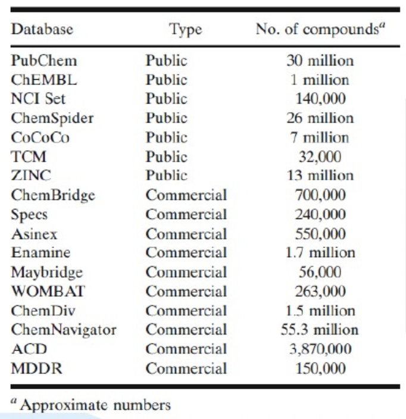

# 药物虚拟筛选研究

## 1 定义

(总结于百度百科)**虚拟筛选**(virtual screening，VS)也称计算机筛选，即在进行[生物活性](https://baike.baidu.com/item/生物活性/5773318)筛选之前，利用计算机软件模拟目标靶点与候选药物之间的相互作用，计算两者之间的亲和力大小，以降低实际筛选化合物数目，同时提高[先导化合物](https://baike.baidu.com/item/先导化合物/259345)发现效率。

(注：原文为“利用计算机上的[分子对接](https://baike.baidu.com/item/分子对接/9987909)软件模拟目标靶点与候选药物之间的相互作用”，但虚拟筛选不仅仅分子对接一种方式，故在此做一些修改。)

===

**分子对接**(molecular docking)是通过[受体](https://baike.baidu.com/item/受体/454383)的特征以及受体和药物分子之间的相互作用方式来进行药物设计的方法。主要研究分子间(如配体和受体)相互作用,并预测其结合模式和亲合力的一种理论模拟方法.近年来,分子对接方法已成为计算机辅助药物研究领域的一项重要[技术](https://baike.baidu.com/item/技术/832247)。

**先导化合物**（lead compound）简称先导物，是通过各种途径和手段得到的具有某种生物活性和[化学结构](https://baike.baidu.com/item/化学结构)的化合物，用于进一步的结构改造和修饰，是现代新药研究的出发点。

===

**应用场景**：新药研发

**药物研发一般流程**：功能基因研究 -> 靶点发现 -> 靶标确证 -> **先导化合物发现 -> 先导化合物优化**

-> 临床前研究 -> 临床研究 -> 市场

**虚拟筛选研究主体**：化合物、蛋白质、DNA、RNA

**先导化合物筛选方式**([参考](https://wenku.baidu.com/view/f69f699e81c758f5f61f67bb.html))：

1. 高通量筛选(体外活性测试、命中率0.01%-0.001%、假阴性高、需先有大量化合物) 
2. 虚拟筛选(计算机模拟分析、命中率2%-24%、有限化合物测试)

**虚拟筛选的方式**：

1. 药效团筛选（基于小分子结构的筛选）通过分析一个或多个活性小分子的药效特征，推纳概括出使得分子具有活性的重要药效基团特征。计算量小
2. 分子对接（基于药物作用机理的筛选）基于靶标蛋白结构的药物筛选方式，通过小分子化合物与靶标进行分子对接，综合分析得分及空间构象情况。
3. De Novo化合物设计（根据蛋白质结构进行全新药物设计）

**瓶颈**：分子种类繁多，对接效率太低，计算力要求高

## 2 相关

**化合物常用数据库**：

说明：在做分子对接、药效团筛选或形状相似性筛选时，一般选取多样性较好的小分子数据库，ZINC免费数据库收录了ChemBridge、Enamine和PubChem等众多化合物数据，可全部免费下载并可下载单个供应商的数据。包括片段库、类药性库、药物库、天然产物库等。柏含生物科技提供下载服务和小分子优化工作，并构建了天然产物数据库、中药材数据库、药物库等，这些化合物含有供应商、分子量、可旋转键数、氢键受体及供体等信息。

## 3 论文阅读

### **查询方向：基于结构的虚拟筛选 - Structure-based virtual screening (SBVS)**

[ParaVS: A Simple, Fast, Efficient and Flexible Graph Neural Network Framework for Structure-Based Virtual Screening](https://arxiv.org/abs/2102.06086)

name:"2102.06086"

word: in silico technique[采用计算机方法的] 、molecular docking[分子对接]、simultaneously[同时]、in-house[内部的]、Decoys[诱饵]、absolute binding affinity[绝对结合亲和力]、siamese network[孪生神经网络]、cutoff distance[?]、denote[表示]、readout function[读出函数，图神经网络的专有名词]、Empirical functions[经验分布函数]、Coefficient of Variation[变异系数]、standard deviation[标准差]、dispersion[分散]、amino[氨基]

摘要简述：基于结构的虚拟筛选(SBVS)是一种有前途的计算机电脑模拟技术，他将计算方法与药物设计结合起来。SBVS广泛采用的一种方法是分子对接。但分子对接很难被同时计算的高效而准确，因为经典力学评分函数是用来近似的，这种方法很难达到量子力学的精度。为了减少计算蛋白-受体评分过程的开销，并用数据驱动的方式来提高评分函数的准确度，我们提出一种基于对接的SBVS方法，此外，还有一种深度学习的非对接方法，这种方法可以避免计算对接过程的开销。然后，我们尝试合并两种方法到一个容易使用的框架中，ParaVS，这位研究者们提供了两种选择。图神经网络被部署在ParaVS上，并且我们解释了我们内部的GNN，HagNet，是怎样建模配体和分子靶标的。为了验证我们的方法，我们在两个数据集上采用了交叉验证的方法，一个是开放数据集Directory of Useful Decoys: Enhanced (DUD.E)，一个是没有计算生成的人工诱饵的内部专有数据集(NoDecoy)。在DUD.E我们达到了最先进的AUC为0.981和最先进的富集因子为36.2的2%；在NoDecoy中我们达到了AUC为0.974.我们进一步完成了一个开放数据集的预测，Enamine REAL Database(RDB), 它包含了超过1.36百万分子，在我们的非对接方法中使用了4050核心时数。在ParaVS-ND中大约3.6e5分子每核心时，这个时间比卷积对接方法快16000倍。这个试验说明了ParaVS是准确并且计算高效的，并且可以在虚拟筛选方面泛化到不同的分子靶标。此外，ParaVS简单而灵活，因为大多数AI组件可以随着特定的需求和未来的发展来替代和升级。ParaVS-ND发布在http://aidd.ghddi.org/sbvs/

关键信息：

基于对接的虚拟筛选太费时间和算力，结果也不是非常可靠，高质量的数据也很有限。为此提出非对接的框架。一种常见的框架是把配体和蛋白整合到一个单独的神经网络中而不用知道三维结合结构。Karimi的DeepAffnity，用蛋白质序列和简化的分子字符串(SMILES, simplified molecular-input line-entry system)作为输入。Gao开发了一个由RNN和GNN构成的孪生神经网络(siamese network)，并且他们也把注意力机制加入了他们的模型来提高泛化能力。

GNN使用方面，将配体和蛋白建模为图，其中的节点是原子，边被简单定义成**cutoff distance**([截止距离？](https://en.wikipedia.org/wiki/Cutoff_(physics))) c，然后GNN通过原子嵌入层$h_u \in \mathbb{R}^H$来表示原子，通过边嵌入层$e_{uv} \in \mathbb{R}^H$来表示边。该领域的大多数GNN模型都可以被总结为两阶段结构，为人熟知的有消息传递架构：1. 通过在每层邻居节点的聚合来在邻居见传播节点信息。2.通过一个读出函数(read-out function)来形成整个图的表示，每层可以被写成：
$$
\vec{h}_v^{(l+1)} = f_\theta^{(l)}(\vec{h}_v^{(l)},\{\vec{x}_e:e\in \mathcal{N}_E(v)\},\{\vec{h}_{v^{\prime}}^{(l)}:v^{\prime}\in\mathcal{N}_V(v)\}) \tag{1}
$$
其中$\vec{h}_v^{(l)}$是节点v在l层的特征向量。$\mathcal{N}_V(v)$和$\mathcal{N}_E(v)$分别表示连接到节点v的节点和边的集合，$f_{\theta}^{(l)}$是参数化函数。读出函数$R$通过池化从最后一次迭代$K$中得的节点特征，来获得整个图的表示$h_G$:
$$
\vec{h}_G = R(\{h_v^K | v \in G\}) \tag{2}
$$
在该论文实践中使用自建GNN，HagNet，被描述为：
$$
\vec{h}_v^{(l+1)} = \phi(concat(h_v^l,(\sum_{u\in\mathcal{N}(v)}{h^l_u}+max_{u\in\mathcal{N}(v)}h^l_u))) \tag{3}
$$
其中$\phi$是多层感知机神经网络和concat层连接特征。

### **查询方向：美白靶点蛋白**

（+）MC1R黑色素合成膜蛋白

